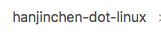

mConfig
=======

Description
---

hanjinchen's linux dev environment.

Tools I used include **tmux**, **zsh**, **vim** and **git**.
this repo also contains a simple **bash** config.
note that most of the command alias are shared both in **bath** & **zsh**.

this config will use **zsh** as the default shell in **tmux**.

How to Install
---

just execute

    sh deploy.sh

What's inside
---

### binaries

some portable binaries, most importantly, the **tmux**.

### vim

A simple vim config which contains some basic plugins like

-   **taglist** show functions in the c/cpp/java files, needs *ctags* to work.
-   **status_line** a simple plugin to extend the statusline.
-   **vary** you can use `:Trim` command to auto remote the trailing whitespaces.
-   **indentLine** used to indicating indents

vim SHORTCUTS:

**taglist**
-   `fl` toggle taglist window

**buffers**
-   `ff` show a list of buffers, and waiting for further inputs for buffer switching
-   `fn`, `fp` move to next/previous buffer
-   `fj` switch to last buffer

**windows**
-   `C-w v`, `C-w s` split current window vertically/horizontally
-   `C-h`, `C-j`, `C-k`, `C-l` switch to the window left/down/up/right to the current one

### tmux

default **escape key** is `C-q`.

SHORCUTS

**Normal(escape key needed)**
-   `c` create window
-   `n`, `p` move to next/prev window
-   `C-q`, `l` previous window
-   `%`, `"` split current panel vertically/horizontally
-   `[`, `C-[` enter copy-mode

**Direct Mapping(no escape key needed)**
-   `A-c` create a new window
-   `A-n`, `A-p` move to next/prev window
-   `A-h`, `A-j`, `A-k`, `A-l` move to left/down/up/right panel

COMMAND ALIAS

``` bash
# make tmux support 256-color
alias tmux="tmux -2"
# attach to a specific tmux session
alias ta='tmux attach -d -t'
# list all the tmux sessions
alias tls='tmux ls'
```

### Git

COMMAND ALIAS

``` bash
alias gco="git checkout"
alias gst="git status -uno"
alias gstn="git status -unormal"
alias gsta="git status -uall"
alias glg='git log --pretty=format:"%C(yellow)%H %C(blue)%an%C(red) %s %C(reset)%n%cD, %cr" --stat -n 5'
alias glgo='git log --pretty=oneline --graph -n 5'
alias glgs='git log --pretty=short --graph -n 5'
alias glgm='git log --pretty=medium --graph -n 5'
alias gdf='git diff'
alias gb='git branch -av'
alias gbd='git branch -d'
alias gru='git remote update'
alias gru!='git remote update --prune'
alias gad='git add'
alias gcmt='git commit'
alias gcmt!='git commit --amend'
alias gcmtm='git commit -m'
alias gmg='git merge'
alias grb='git rebase'
```

### Baidu Specific

-   add `comake2`, `upload.py` into binaries.

-   add `icr` scripts for easily issuing icode code review, the usage is

        icr upstream-branch

    this scripts use HEAD as local branch, so if you need to issus a code review on another branch,
    switch to it first!

-   some installation scripts in `intstalls` folder

